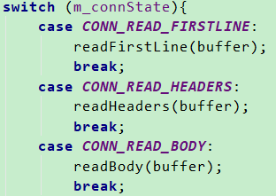
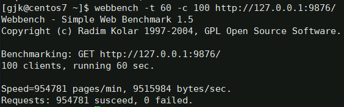
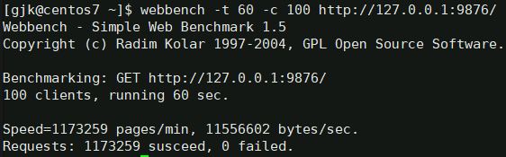
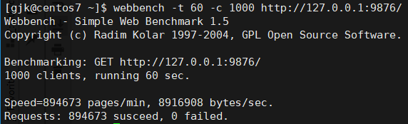
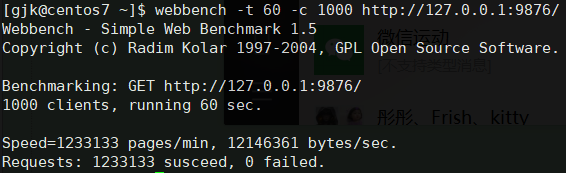
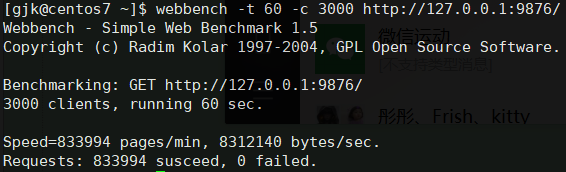
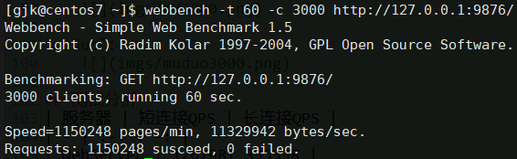

# KYHttpServer
用C++11写的Http服务器，把之前所学的知识串联了起来，加深理解。很多东西都参考了`Libevent`和`muduo`的实现，收益颇多。

## 开发环境
- 个人电脑：Windows 10
- 开发工具：CLion
- 调试运行：Centos7
- 编译器：g++ 4.8.5

## 设计思路
### TCP服务
- 使用Reactor模型作为总体的网络框架
- 模拟一个线程池来处理IO事件
- 封装一个Buffer类用来缓存对socket的读/写
- 使用epoll+ET

### Http服务
- 创建HttpServer类来管理用户的设置，例如端口、线程、对请求处理的controller
- 封装报文基类，并派生出请求类和响应类，作为用户回调的参数
- 从TCP接收数据，直到接收+解析完成，根据uri调用不同的用户回调
- 每条TCP连接都相应的创建一个http连接，实现对长/短连接的控制
- 接收数据或者解析出错时，直接返回相应的错误给客户端

### Log服务
- 用生产者-消费者模型实现一个异步日志服务
- 创建简洁通用的接口

## 遇到的问题
### 1、如何优雅的从读取的数据中解析出Http报文
因为报文内容可能不会读一次数据就全部收到，如何简洁且安全的解析出报文挺麻烦的。一开始对于这个没有什么好思路，后来看了libevent的实现后觉得不错，就按照它的思路来写：  

1. 给Http连接设置不同的状态，例如`READ_FIRSTLINE`、`READ_HEADERS`、`READ_BODY`。
2. 根据当前状态解析出对应的数据，如果数据不够就返回，等下次数据够了，再根据状态来解析。
3. 每次收到一个Http连接就创建一个`HttpRequest`对象，来保存当前以读取到的数据。

	

### 2、如何进行TCP服务中主线程和IO线程之间的通信
接收连接的主线程，在接收到新的客户端连接后，把客户端的`socket fd`交给IO线程去处理。关键在于IO线程可能是阻塞在epoll_wait中的，把数据交给IO线程后还要唤醒它。在这里修改了几次：
  
1. Linux的`eventfd`。  
每次有新的连接，主线程往IO线程监听的`eventfd`中写客户端的`socketfd`。然后IO线程自然就被唤醒，然后读出客户端的fd，创建连接，进行后续操作。**但是**当并发测试的时候发现，如果多次往`eventfd`写而来不及读的话，这些fd就会**累加**到一起。所以只能放弃了这个方法。

2. `pipe`  
IO线程创建一个管道，从写端写客户端的`socket fd`，从读端读出它，再创建连接。本质上思路还是上一个一样。而且这种也可以正常工作。**但是**做并发测试的时候，发现效率并不高。

3. `eventfd`唤醒+队列+互斥锁  
上一步效率不高，尝试使用比较原始的办法。主线程将客户端的fd加入到IO线程的待处理队列种，然后用`eventfd`来唤醒IO线程，IO线程看到是eventfd，则去队列中取出新连接的fd并进行后续操作。**经测试**，在只修改这里所说的线程间通信方式的情况下，使用这种方法，比使用`pipe`，**并发量提高了将近1/4**。

### 3、TCP连接的关闭
建立连接和关闭的难度完全不对称，类似读和写也不对称。这里处理了两种情况：
  
1. 当读/写出现非可恢复错误时。
2. EPOLL触发事件，但是读取的数据量为0。

### 4、Http连接的关闭
在TCP没有断开连接时，Http什么时候该主动去关闭连接。这个要根据HTTP版本和头部字段来区分处理。目前的实现是：  

1. HTTP/1.1中，默认是不关闭连接的，如果请求头中有`Connection: close`则主动关闭。
2. HTTP/1.0中，默认是关闭连接的，如果请求头中有`Connection: keep-alive`则保持连接。
3. 当请求出现错误时关闭连接。

### 5、Buffer的实现
在`libevent`中实现的`evbuffer`是用双向链表来实现的，每个节点中持有一定量的数据。`muduo`中使用`vector<char>`来模拟了buffer。为了简洁，我直接使用了`std::string`来模拟buffer：

1. 维护首尾两个指针，来表示有效数据。
2. 当有新数据时用replace方法放到尾部，空间不够则用reserve扩展
3. 当读取数据时移动首指针，来模拟有效数据的减少。
4. 当数据读完后，把双指针移到string的头部，重复利用空间。

期间还遇到了个问题，`stirng.resize`把容量变小的时候遇到了崩溃的问题，至今没有思路，网上也搜不到任何相关内容。

## 并发测试
由于我手上只有一台**1核2G**的服务器，所以只能用同一台机器来测试了。况且网络因素往往会比CPU和内存先达到瓶颈，所以单纯测试能够支持的并发量，本地回环也足够了。  

1. 测试工具：[WebBench](https://github.com/EZLippi/WebBench)。
2. 和`muduo`进行对比，GET同样的512B内容，对比并发量大小。
3. 测试时间均为60s，最后计算QPS。  
4. 因为服务器是只有一个核心，所以多线程效果不会太明显，所以均使用1个IO线程。

### 1、100个并发客户端
`KYHttpServer`：  
	

`muduo`：  
	
### 2、1000个并发客户端
`KYHttpServer`：  
	

`muduo`：  
	
### 3、3000个并发客户端

`KYHttpServer`：  
	

`muduo`：  
	

## 测试分析
下面是对测试结果的统计，以**QPS**`(Queries-per-second)` 为单位：

| 并发量| 100 | 1000 | 3000 |
| - | :-: | -: | 
| KYHttpServer | 15913| 14911 | 13899 |
| muduo | 19554 | 20552 | 19170 |

CPU和内存占用随着并发量增大，变化不是很明显，一块给出：

| 系统资源占用| CPU | 内存 |
|-| :-: | :-: |
| KYHttpServer | ≈55% | <1% |
| muduo | ≈48% |  <1% |

从上面看来KYHttpServer和muduo相比还是有一定差距的，下面是几个我觉得导致性能差异的地方：

1. **muduo**的框架结构有良好的设计，**KYHttpServer**只是目前按照我的想法写出来的，还有很大优化空间。
2. **muduo**使用了`readv`，**KYHttpServer**简单的使用`read`，后续可以对比下这两个的性能。
3. **muduo**使用`vector`来封装Buffer，直接拷贝内存，**KYHttpServer**使用string，基本上都是字符串的复制。
4. 代码实现上应该还有写的不好的地方，后续可以在时间复杂度上优化一些。

## 后续计划

1. 优化服务器性能。
2. 增加Timer以及一些超时的处理。
3. 学习一下CGI的相关内容，添加进来。